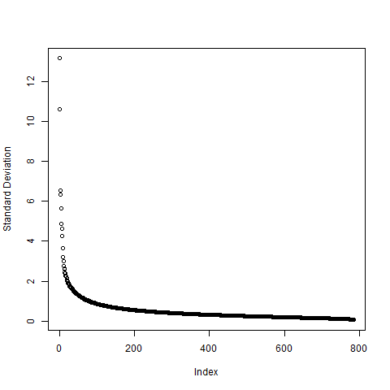
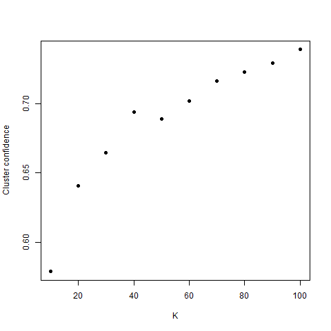

\newpage

# Project Summary

This project is on implementing classification algorithm on the Fashion-MNIST dataset. To begin with we pre process the data using PCA to extract enough useful information so that the data contains a signal but also reduce it enough for the algorithms to be fast.

First we try a K-means unsupervised algorithm to cluster the data hoping that it will be able to divide the labels. Unfortunately the clusters we get even with taking K=100 don't have a uniform label. There are a lot of mixed labels in each cluster. The ratio of majority vote in cluster to total cluster size we get is 73%, which is low.

Next we try supervised learning. We try 4 different methods, random forest, k-NN, linear SVM and kernel SVM. We use 5 fold cross validation to tune the parameter k in k-NN. The best k we achieve is k=10. The 10-NN algorithm gives us an accuracy of 85.6%. Random forest achieves the accuracy of 88.5%, which is better than that of 10-NN. The SVM classifier is a binary classifier which we adapt to our multiclass classification by using two approaches, One vs Rest and One vs One. We use the One vs One approach which achieves an accuracy of 81.2% in the linear version and 90.8% in the kernel version. This clearly outperforms the previous two algorithms.

Finally we create and ensemble model using multiple classifiers. We use kNN, random forest, kernel SVM and PCA-SVM(SVM after performing PCA). After fitting these models, we use the majority vote to predict the final label. The ensemble model performs marginally better than the SVM model to get an accuracy of 91.1%.

In conclusion, the ensemble model performs the best, but it has high computational cost as it has to train multiple models. The advantage of the ensemble model is that it is flexible.

# Literature review

The Fashion-MNIST data set has been created by researchers at Zalando for the purposes of benchmarking ML algorithms. It consists of 70000 grayscale images of dimension 28*28. These are images of clothing articles like T-shirt, Trouser, Pullover etc with 60000 training samples and 10000 testing samples. The purpose of this data set is to provide a more challenging classifying compared to the original MNIST data. There are algorithms which 99% accuracy on this making it too easy for modern algorithms.

The best accuracy we found was by a GitHub user named [_Andy Brock_](https://github.com/ajbrock) who was able to achieve an accuracy of 96.7% using wide residual networks. A lot of people have implemented algorithms with high accuracy. They can be for on [_Zalando Research's GitHub page_](https://github.com/zalandoresearch/fashion-mnist).

@xiao2017/online test out a variety of classifiers including Decision Tree ,Gradient Boosting, K Neighbors, Linear SVC, Logistic Regression and many more. They achieve the best result using the SVC classifier with C=10 and the rbf kernel. The testing accuracy for this algorithm is 89.7% on the fashion data set and 97.3% on the original MNIST data. Gradient boosting performs well with testing accuracy at 88% and 96.9% respectively. This is achieved for n_estimators=100 and max_depth=10.

@meshkini2019analysis perform classification on the Fashion-MNIST data set using convolutional neural networks. They compare the performance of several well-known deep learning frameworks, such as AlexNet, GoogleNet, VGG and ResNet, DenseNet and SqueezeNet. The authors also propose an additional step of batch normalization to enhance the training speed and accuracy of the model. The best results are achieved by ResNet44 and SqueezeNet with batch normalization with testing accuracy at 93.39% and 93.43% respectively. 


```{r, echo=FALSE, warning=FALSE}
library(knitr)
library(kableExtra)
library(gridExtra)
library(grid)
```

```{r, echo=FALSE, warning=F}
train = read.csv("Karthik/fashion-mnist_train.csv")
test = read.csv("Karthik/fashion-mnist_test.csv")

Xtrain = train[,2:785]
Ytrain = train[,1]

Xtest = test[,2:785]
Ytest = test[,1]
```

\newpage

# Summary Statistics

Data table
```{r, echo=FALSE, warning=F}
table(Ytrain)
table(Ytest)
```


# Pre processing

Before using PCA we have scaled and centered the data.


## PCA

We perform PCA on the training data set and plot the standard deviation of each of the components in descending order. Using the elbow method the cutoff we choose is 1.75 and take all the components which have standard deviation above that value. It gives 28 components.

```{r, echo=F, warning=F, fig.align='center', out.height='50%', out.width = '50%'}

```

\newpage

# Clustering


## Kmeans

To first determine which K to use we run the kmeans algorithm for k =10,20,...,100 and measure for each cluster the ration # of votes the majority label got/ total number of elements in the clustes. We also sum over all the clusters by weighing the ratios according to the cluster size. The plot of this cluster confidence vs K is as follows.


```{r, echo=FALSE, warning=F, fig.align='center', fig.cap='Cluster confidence vs K', out.height='50%', out.width = '50%'}

```

From this plot we can see that as we increase K the confidence increases. We choose K=100 so that to get the best clustering while keeping computation time low.

The cluster confidence is 73.58% and the majority label in each cluster are as follows

```{r, echo=FALSE, warning=F}

cluster_prediction = t(read.csv("Karthik/data/kmeans_prediction.csv"))
print(cluster_prediction)
```

\clearpage

# Multi-class Classification Model

In this section, we implement multi-class classification models on the Fashion-MNIST dataset. We first use two algorithms, k-Nearest Neighbor (k-NN) and random forest, which can be directly used for multiclass classification. Then, we extend Support Vector Machine (SVM), which is a binary classifier, to handle the multiclass case.

## k-Nearest Neighbors

We first implement k-NN classification model to classify the Fashion-MNIST data. The Euclidean distance is used to measure the distance between variables. The raw data are scaled in the data pre-processing step, so the distance is scale-invariant.

To determine the parameter k, we use 5-fold cross-validation and calculate the overall mis-classification rate for each k. The figure shows the relation between mis-classification rate and k. We find that the best mis-classification rate is reached at $k = 10$.

```{r, echo=F, warning=F, fig.align='center', fig.cap='5-fold CV Mis-classification Rate', out.height='50%', out.width = '50%'}
library(knitr)
library(kableExtra)
library(gridExtra)
library(grid)
load("Yining/RData/knn.RData")
load("Yining/RData/rf_svm.RData")
include_graphics("Yining/graph/knn_cv.png")
```

Based on the result of cross-valiadation, we choose $k = 10$ to fit the k-NN model. The confusion matrix and mis-classification rate for each class are shown in the following two tables. For Fashion-MNIST data, the overall mis-classification rate of the 10-NN classifier is 0.144 and the testing accuracy is 0.856.

```{r, echo=F, warning=F, fig.align='center', fig.cap='10-NN', fig.subcap= c('Confusion Matrix', 'Mis-classification Rate'), out.width = '50%'}
colnames(misclass) = c("class", "mis-classification")
include_graphics("Yining/graph/knn_confuse.png")
grid.newpage()
grid.table(rbind(misclass, c("overall", round(overall_misclass,3))), theme = ttheme_minimal())
```

## Random Forest

We then classify the Fashion-MNIST data using the random forest. The confusion matrix and mis-classification rate for each class are shown in the following two tables. The overall mis-classification rate of random forest is 0.115 and the testing accuracy is 0.885. The results show that random forest has a better performance than 10-NN classifer. 

```{r, echo=F, warning=F, fig.align='center', fig.cap='Random Forest', fig.subcap= c('Confusion Matrix', 'Mis-classification Rate'), out.width = '50%'}
colnames(misclass_tree) = c("class", "mis-classification")
include_graphics("Yining/graph/tree_confuse.png")
grid.newpage()
grid.table(rbind(misclass_tree, c("overall", round(overall_misclass_tree,3))), theme = ttheme_minimal())
```

## Support Vector Machine

We have applied two multiclass classifiers k-NN and random forest for the Fashion-MNIST classification. Now, we extend SVM to the multiclass form to solve the classification problem. SVM is a binary classifier and it does not support multiclass classification natively. However, we can break the multiclass classification problem into several binary ones. There are two common methods to extend SVM for multiclass classification, One-vs-One approach and One-vs-Rest approach. 

In One-vs-One approach, we fit SVM models for every two classes. Each classifier separates points of two different classes. Suppose we have k classes, we then fit $\frac{k(k-1)}{2}$ SVM models. In prediction stage, we input data into all binary classifiers. Each binary classifiers will decide a class that the input is belonged to. We let those binary classifiers vote for the class of input, and the prediction result is the class that most classifiers vote for.

In One-vs-Rest approach, we fit SVM models to distinguish points of one certain class from the other classes. Suppose we have k classes, we then fit k SVM models. In prediction stage, we input data into all One-vs-Rest classifiers. Each classifier will give a probability that the input is belonged to that class. The prediction result is the class with the largest probability.

One-vs-Rest approach is more computationally efficient than One-vs-One approach, since it only need to fit k SVM models while One-vs-One approach need to fit $\frac{k(k-1)}{2}$ models. However, in One-vs-Rest approach, the training data is unbalanced since the ratio of training data from each class is $1:(k-1)$, which may cause biase.

We fit the multiclass SVM model using One-vs-One approach, with using radial basis kernel. The overall mis-classification rate of kernel SVM is 0.092 and the testing accuracy is 0.908. The kernel SVM classifier outperforms k-NN and random forest. 

```{r, echo=F, warning=F, fig.align='center', fig.cap='Kernel SVM (rbf)', fig.subcap= c('Confusion Matrix', 'Mis-classification Rate', '1', '2'), out.width = '50%'}
colnames(misclass_svm) = c("class", "mis-classification")
include_graphics("Yining/graph/svm_confuse.png")
grid.newpage()
grid.table(rbind(misclass_svm, c("overall", round(overall_misclass_svm,3))), theme = ttheme_minimal())
```

In addition, a linear SVM model is constructed to compare with the RBF kernel. The overall mis-classification rate of linear SVM is 0.188 and the testing accuracy is 0.812.

Though linear SVM model does not perform better than k-NN and random forest, SVM with RBF kernel have a quite good performance on classification, which achieves an overall accuracy of 90.8%.

```{r, echo=F, warning=F, fig.align='center', fig.cap='Linear SVM', fig.subcap= c('Confusion Matrix', 'Mis-classification Rate'), out.width = '50%'}
colnames(misclass_lsvm) = c("class", "mis-classification")
include_graphics("Yining/graph/lsvm_confuse.png")
grid.newpage()
grid.table(rbind(misclass_svm, c("overall", round(overall_misclass_lsvm,3))), theme = ttheme_minimal())
```

## Conclusion

In this part, we build k-NN, random forest, linear SVM and kernel SVM to classify Fashion-MNIST data. The testing accuracy of different algorithms are shown in the table. The testing accuracy of four methods: kernel SVM > random forest > k-NN > linear SVM.

```{r, echo=F, warning=F, fig.align='center'}
model_summary = data.frame("kNN"=1-overall_misclass, "Random Forest"=1-overall_misclass_tree, "Linear SVM"=1-overall_misclass_lsvm, "Kernel SVM"=1-overall_misclass_svm)
row.names(model_summary) = c("Accuracy")
kable(model_summary, format="latex", caption="Model Summary")%>%kable_styling(position = "center", latex_options = "HOLD_position")
```
 
```{r, echo=F, warning=F, fig.align='center', fig.cap='5-fold CV Mis-classification Rate', out.height='50%', out.width = '50%'}
load("Yining/RData/ensemble.RData")
```

# Ensemble Model

In the last two sections, we have implemented unsupervised learning and supervised learning on Fashion-MNIST classification respectively. Now, we combine unsupervised learning and supervised learning together to build a joint model with a better accuracy of classification. 

## PCA-SVM

We first combine principal component analysis (PCA) and support vector machine (SVM) to create a classification pipeline. In the first stage, we apply PCA to reduce the dimensions of feature space as well as make features orthogonal to each other. In the second stage, we select components with great deviation among principal components, and use them as input to fit a SVM classifier.

We use the elbow method with the cutoff 1.75 and take all the components which have standard deviation above that value, which gives 28 components. We use those 28 components to fit a multiclass kernel SVM with RBF kernel, which is demonstrated in the classification part. Before performing PCA, we preprocess the data by subtracting the mean and scale it to variance 1.

The confusion matrix and mis-classification rate for each class are shown in the following two tables. The overall mis-classification rate of PCA-SVM classifier is 0.112 and the testing accuracy is 0.888, which is better than random forest but worse than the origin SVM.

```{r, echo=F, warning=F, fig.align='center', fig.cap='PCA-SVM', fig.subcap= c('Confusion Matrix', 'Mis-classification Rate'), out.width = '50%'}
colnames(misclass_psvm) = c("class", "mis-classification")
include_graphics("Yining/graph/pca_confuse.png")
grid.newpage()
grid.table(rbind(misclass_psvm, c("overall", round(overall_misclass_psvm,3))), theme = ttheme_minimal())
```

Though our PCA-SVM classifier does not improve the classification performance compared with the origin SVM, the classifier still explores some features of the data that the origin model may not have explored. Our next step is to combine PCA-SVM and SVM, in additional to random forest and k-NN model to build an ensemble classifer.

## Ensemble Model

The classification models are limited to certain type of data structure. However, in real-world problems, it is difficult to find a model that well satisfied the data structure of the problem. Thus, ensemble multiple classification models and combine the information together may result in a more robust model which has a better performance than the single model.

We combine four different models, k-NN, random forest, kernel SVM and PCA-SVM, to build an ensemble classification model. The model tuning and performance of the single model is demonstrated in the classification section. The following figure shows the architecture of the ensemble model.

```{r, echo=F, warning=F, fig.align='center', fig.cap='Ensemble Model Architecture'}
include_graphics("Yining/graph/ensemble_model.png")
```

The classification pipeline has two stages. In the first stage, we let k-NN, random forest, kernel SVM and PCA-SVM classify input data respectively. Each classifier will give a predicted label for the input. In the second stage, we let those classifiers vote for the class of input, and the prediction result is the class that most classifiers vote for.

Now, we fit the ensemble model with Fashion-MNIST data. The confusion matrix and mis-classification rate for each class are shown in the following two tables. The overall mis-classification rate of the ensemble model is 0.089 and the testing accuracy is 0.911, which outperforms all of the single model.

```{r, echo=F, warning=F, fig.align='center', fig.cap='Ensemble Model', fig.subcap= c('Confusion Matrix', 'Mis-classification Rate'), out.width = '50%'}
colnames(misclass_en) = c("class", "mis-classification")
include_graphics("Yining/graph/en_confuse.png")
grid.newpage()
grid.table(rbind(misclass_en, c("overall", round(overall_misclass_en,3))), theme = ttheme_minimal())
```

## Conclusion

Finally, we take a comparison between the ensemble model and all other single models. The testing accuracy of different algorithms are shown in the table. We find that the ensemble model indeed utilizes the advantages from different single models and have the best performance among all algorithms.

```{r, echo=F, warning=F, fig.align='center'}
model_summary = data.frame("kNN"=1-overall_misclass, "Random Forest"=1-overall_misclass_tree, "Linear SVM"=1-overall_misclass_lsvm, "Kernel SVM"=1-overall_misclass_svm, "PCA-SVM"=1-overall_misclass_psvm, "Ensemble Model"=1-overall_misclass_en)
row.names(model_summary) = c("Accuracy")
kable(model_summary, format="latex", caption="Model Summary")%>%kable_styling(position = "center", latex_options = "HOLD_position")
```

The computational cost for the ensemble model is relatively high since we need to fit each single model respectively. However, if we have already trained some classifiers and want to further improve the model's performance, the computational cost can be reduced. 

Additionally, the ensemble model is very flexible since it is convenient to add new models or remove inappropriate ones to improve the performance of the ensemble model.

# References


