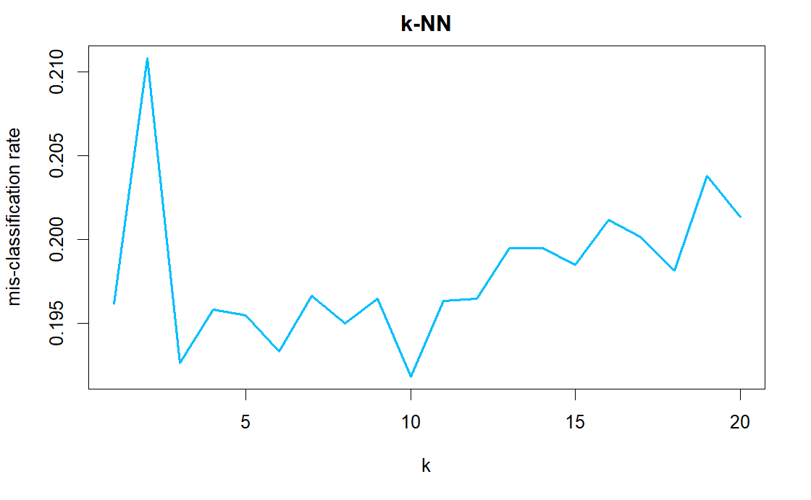

---
output:
  pdf_document:
bibliography: references.bib
header-includes:
  - \usepackage{amsmath}
  - \usepackage{subfig}
---

# Classification

In this section, we implement multi-class classification models on the Fashion-MNIST dataset. We first use two algorithms, k-Nearest Neighbor (k-NN) and Linear Discriminant Analysis (LDA), which can be directly used for multiclass classification. Then, we extend Support Vector Machine (SVM), which is a binary classifier, to handle the multiclass case.

## k-Nearest Neighbors

We first implement k-NN classification model to classify the Fashion-MNIST data. The Euclidean distance is used to measure the distance between variables. The raw data are scaled in the data pre-processing step, so the distance is scale-invariant.

To determine the parameter k, we use 5-fold cross-validation and calculate the overall mis-classification rate for each k. The figure shows the relation between mis-classification rate and k. We find that the best mis-classification rate is reached at $k = 10$.

```{r, echo=F, warning=F, fig.align='center', fig.cap='5-fold CV Mis-classification Rate', out.height='50%', out.width = '50%'}
library(knitr)
library(kableExtra)
library(gridExtra)
library(grid)
load("RData/knn.RData")

```

Based on the result of cross-valiadation, we choose $k = 10$ to fit the k-NN model. The confusion matrix and mis-classification rate for each class are shown in the following two tables. For Fashion-MNIST data, the overall mis-classification rate of the 10-NN classifier is 0.144 and the accuracy is 0.856.

```{r, echo=F, warning=F, fig.align='center', fig.cap='10-NN', fig.subcap= c('Confusion Matrix', 'Mis-classification Rate'), out.width = '50%'}
colnames(misclass) = c("class", "mis-classification")
include_graphics("graph/knn_confuse.png")
grid.newpage()
grid.table(rbind(misclass, c("overall", round(overall_misclass,3))), theme = ttheme_minimal())
```

## LDA

We then classify the Fashion-MNIST data using the LDA classifier. The confusion matrix and mis-classification rate for each class are shown in the following two tables. The overall mis-classification rate of the LDA classifier is 0.174 and the accuracy is 0.826. We find that the accuracy of LDA classifier is slightly lower than that of 10-kNN classifer. 

```{r, echo=F, warning=F, fig.align='center', fig.cap='LDA', fig.subcap= c('Confusion Matrix', 'Mis-classification Rate'), out.width = '50%'}
load("RData/lda_svm.RData")
colnames(misclass_lda) = c("class", "mis-classification")
include_graphics("graph/lda_confuse.png")
grid.newpage()
grid.table(rbind(misclass_lda, c("overall", round(overall_misclass_lda,3))), theme = ttheme_minimal())
```

## SVM

We have applied two multiclass classifiers k-NN and LDA for the Fashion-MNIST classification. Now, we extend SVM to the multiclass form to solve the classification problem. SVM is a binary classifier and it does not support multiclass classification natively. However, we can break the multiclass classification problem into several binary ones. There are two common methods to extend SVM for multiclass classification, One-vs-One approach and One-vs-Rest approach. 

In One-vs-One approach, we fit SVM models for every two classes. Each classifier separates points of two different classes. Suppose we have k classes, we then fit $\frac{k(k-1)}{2}$ SVM models. In prediction stage, we input data into all binary classifiers. Each binary classifiers will decide a class that the input is belonged to. We let those binary classifiers vote for the class of input, and the prediction result is the class that most classifiers vote for.

In One-vs-Rest approach, we fit SVM models to distinguish points of one certain class from the other classes. Suppose we have k classes, we then fit k SVM models. In prediction stage, we input data into all One-vs-Rest classifiers. Each classifier will give a probability that the input is belonged to that class. The prediction result is the class with the largest probability.

One-vs-Rest approach is more computationally efficient than One-vs-One approach, since it only need to fit k SVM models while One-vs-One approach need to fit $\frac{k(k-1)}{2}$ models. However, in One-vs-Rest approach, the training data is unbalanced since the ratio of training data from each class is $1:(k-1)$, which may cause biase.

We fit the multiclass SVM model using One-vs-One approach, with using radial basis kernel. The overall mis-classification rate of kernel SVM is 0.09 and the accuracy is 0.91. The kernel SVM classifier outperforms k-NN and LDA. 

```{r, echo=F, warning=F, fig.align='center', fig.cap='Kernel SVM (rbf)', fig.subcap= c('Confusion Matrix', 'Mis-classification Rate', '1', '2'), out.width = '50%'}
colnames(misclass_svm) = c("class", "mis-classification")
include_graphics("graph/svm_confuse.png")
grid.newpage()
grid.table(rbind(misclass_svm, c("overall", round(overall_misclass_svm,3))), theme = ttheme_minimal())
```

In addition, a linear SVM model is constructed to compare with the RBF kernel. The overall mis-classification rate of linear SVM is 0.188 and the accuracy is 0.812.

Though linear SVM model does not perform better than k-NN and LDA, SVM with RBF kernel have a quite good performance on classification, which achieves an overall accuracy of 90%.

```{r, echo=F, warning=F, fig.align='center', fig.cap='Linear SVM', fig.subcap= c('Confusion Matrix', 'Mis-classification Rate'), out.width = '50%'}
colnames(misclass_lsvm) = c("class", "mis-classification")
include_graphics("graph/lsvm_confuse.png")
grid.newpage()
grid.table(rbind(misclass_svm, c("overall", round(overall_misclass_lsvm,3))), theme = ttheme_minimal())
```

## Conclusion

In this part, we build k-NN, LDA, linear SVM and kernel SVM to classify Fashion-MNIST data. The performace of different algorithms are shown in the table. The accuracy of four methods: kernel SVM > k-NN > LDA > linear SVM.

```{r, echo=F, warning=F, fig.align='center'}
model_summary = data.frame("kNN"=1-overall_misclass, "LDA"=1-overall_misclass_lda, "linear SVM"=1-overall_misclass_lsvm, "kernel SVM"=1-overall_misclass_svm)
row.names(model_summary) = c("Accuracy")
kable(model_summary, format="latex", caption="Model Summary")%>%kable_styling(position = "center", latex_options = "HOLD_position")
```