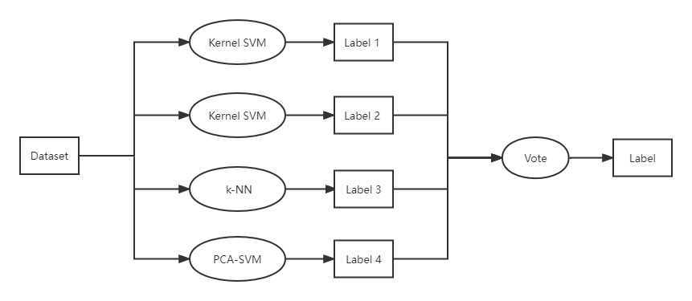

---
output:
  pdf_document:
bibliography: references.bib
header-includes:
  - \usepackage{amsmath}
  - \usepackage{subfig}
---

```{r, echo=F, warning=F, fig.align='center', fig.cap='5-fold CV Mis-classification Rate', out.height='50%', out.width = '50%'}
library(knitr)
library(kableExtra)
library(gridExtra)
library(grid)
load("RData/ensemble.RData")
```

# Ensemble Model

In the last two sections, we have implemented unsupervised learning and supervised learning on Fashion-MNIST classification respectively. Now, we combine unsupervised learning and supervised learning together to build a joint model with a better accuracy of classification. 

## PCA-SVM

We first combine principal component analysis (PCA) and support vector machine (SVM) to create a classification pipeline. In the first stage, we apply PCA to reduce the dimensions of feature space as well as make features orthogonal to each other. In the second stage, we select components with great deviation among principal components, and use them as input to fit a SVM classifier.

We use the elbow method with the cutoff 1.75 and take all the components which have standard deviation above that value, which gives 28 components. We use those 28 components to fit a multiclass kernel SVM with RBF kernel, which is demonstrated in the classification part. Before performing PCA, we preprocess the data by subtracting the mean and scale it to variance 1.

The confusion matrix and mis-classification rate for each class are shown in the following two tables. The overall mis-classification rate of PCA-SVM classifier is 0.112 and the testing accuracy is 0.888, which is better than random forest but worse than the origin SVM.

```{r, echo=F, warning=F, fig.align='center', fig.cap='PCA-SVM', fig.subcap= c('Confusion Matrix', 'Mis-classification Rate'), out.width = '50%'}
colnames(misclass_psvm) = c("class", "mis-classification")
include_graphics("graph/pca_confuse.png")
grid.newpage()
grid.table(rbind(misclass_psvm, c("overall", round(overall_misclass_psvm,3))), theme = ttheme_minimal())
```

Though our PCA-SVM classifier does not improve the classification performance compared with the origin SVM, the classifier still explores some features of the data that the origin model may not have explored. Our next step is to combine PCA-SVM and SVM, in additional to random forest and k-NN model to build an ensemble classifer.

## Ensemble Model

The classification models are limited to certain type of data structure. However, in real-world problems, it is difficult to find a model that well satisfied the data structure of the problem. Thus, ensemble multiple classification models and combine the information together may result in a more robust model which has a better performance than the single model.

We combine four different models, k-NN, random forest, kernel SVM and PCA-SVM, to build an ensemble classification model. The model tuning and performance of the single model is demonstrated in the classification section. The following figure shows the architecture of the ensemble model.

```{r, echo=F, warning=F, fig.align='center', fig.cap='Ensemble Model Architecture'}

```

The classification pipeline has two stages. In the first stage, we let k-NN, random forest, kernel SVM and PCA-SVM classify input data respectively. Each classifier will give a predicted label for the input. In the second stage, we let those classifiers vote for the class of input, and the prediction result is the class that most classifiers vote for.

Now, we fit the ensemble model with Fashion-MNIST data. The confusion matrix and mis-classification rate for each class are shown in the following two tables. The overall mis-classification rate of the ensemble model is 0.089 and the testing accuracy is 0.911, which outperforms all of the single model.

```{r, echo=F, warning=F, fig.align='center', fig.cap='Ensemble Model', fig.subcap= c('Confusion Matrix', 'Mis-classification Rate'), out.width = '50%'}
colnames(misclass_en) = c("class", "mis-classification")
include_graphics("graph/en_confuse.png")
grid.newpage()
grid.table(rbind(misclass_en, c("overall", round(overall_misclass_en,3))), theme = ttheme_minimal())
```

## Conclusion

Finally, we take a comparison between the ensemble model and all other single models. The testing accuracy of different algorithms are shown in the table. We find that the ensemble model indeed utilizes the advantages from different single models and have the best performance among all algorithms.

```{r, echo=F, warning=F, fig.align='center'}
model_summary = data.frame("kNN"=1-overall_misclass, "Random Forest"=1-overall_misclass_tree, "Linear SVM"=1-overall_misclass_lsvm, "Kernel SVM"=1-overall_misclass_svm, "PCA-SVM"=1-overall_misclass_psvm, "Ensemble Model"=1-overall_misclass_en)
row.names(model_summary) = c("Accuracy")
kable(model_summary, format="latex", caption="Model Summary")%>%kable_styling(position = "center", latex_options = "HOLD_position")
```

The computational cost for the ensemble model is relatively high since we need to fit each single model respectively. However, if we have already trained some classifiers and want to further improve the model's performance, the computational cost can be reduced. 

Additionally, the ensemble model is very flexible since it is convenient to add new models or remove inappropriate ones to improve the performance of the ensemble model.